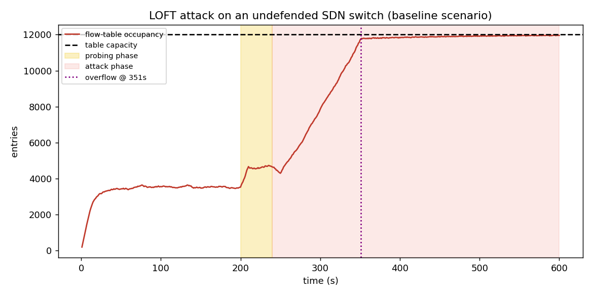
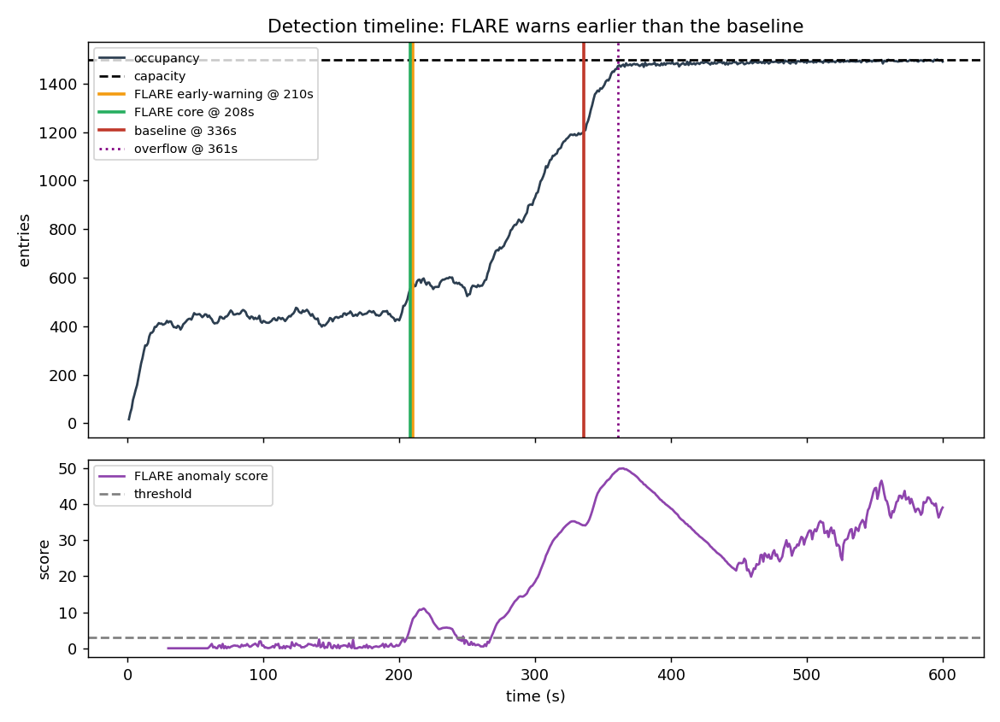
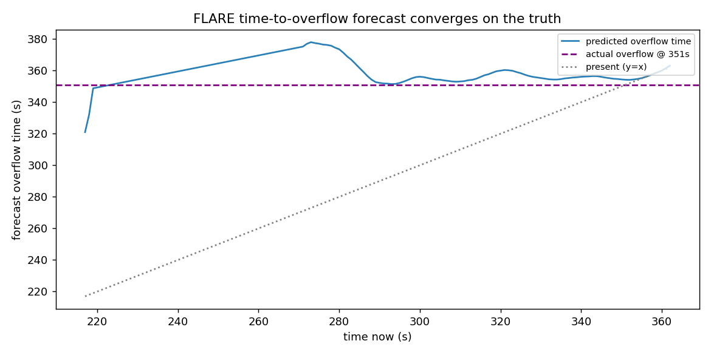
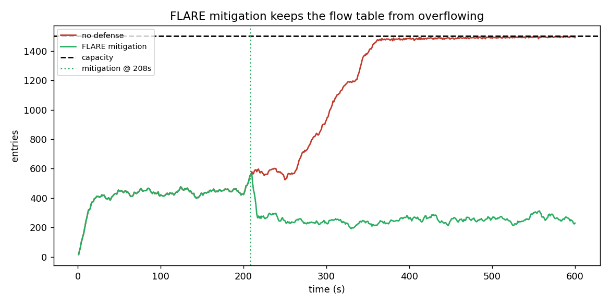

# FLARE

### Early Detection of Low-Rate Flow-Table Overflow (LOFT) Attacks in Software-Defined Networks

[](https://colab.research.google.com/github/prakhar443/project_FLARE/blob/claude/affectionate-archimedes-rjk02/notebooks/FLARE_Colab.ipynb)

▶️ **Run it now in Google Colab (no setup, no hardware):**
https://colab.research.google.com/github/prakhar443/project_FLARE/blob/claude/affectionate-archimedes-rjk02/notebooks/FLARE_Colab.ipynb

---

## In one sentence

**FLARE is an early-warning system for a stealthy network attack that slowly
clogs a switch's memory — it sounds the alarm minutes before the switch breaks,
predicts *when* it will break, and explains *why* it is worried.**

Everything in this repository — the attack, the defense, the experiments, and
the figures below — runs end-to-end in a free Google Colab notebook.

---

## The problem, in plain terms

A modern network switch keeps a **flow table**: a list of rules telling it where
to send traffic. That table lives in a small, expensive memory that only holds a
few thousand entries.

A **Low-Rate Flow-Table Overflow (LOFT)** attack abuses this limit. Instead of
flooding the network (which is easy to spot), the attacker quietly adds a trickle
of junk rules, each kept barely alive so it never expires. Like a slow drip
filling a bucket, the table fills up using **almost no traffic** — so traditional
"too much traffic!" defenses never notice. Once the table is full, **legitimate
traffic can no longer be served and the network degrades.**

> **Analogy:** it's not a stampede crashing through the door (a flood attack).
> It's someone quietly leaving one coat on every chair in a restaurant until no
> real customer can sit down — and doing it so calmly that the staff never react.

## Why existing defenses fall short

The closest published method (*FloRa*, IEEE 2024) is **reactive**: it only raises
an alarm once the table is *already* dangerously full. By then there is very
little time left to respond.

## What FLARE adds

FLARE turns the defense from *reactive* into *anticipatory*, with four
capabilities:

| # | Capability | What it means for an operator |
|---|------------|-------------------------------|
| 1 | **Early warning** | Before filling the table, a smart attacker first *probes* the switch to learn its timing. FLARE detects this quiet reconnaissance and raises a flag **before any damage starts**. |
| 2 | **Adapts on the fly** | Normal traffic changes hour to hour. FLARE continuously relearns what "normal" looks like, so it stays accurate **without being taken offline and retrained**. |
| 3 | **Forecasts the risk** | Instead of a yes/no alarm, FLARE answers the question operators actually care about: **"how long until the table overflows?"** |
| 4 | **Explains its alerts** | Every alert comes with a plain-language reason (e.g. *"burst of short-lived probe-like flows"*), so the team can **trust it and act fast**. |

---

## Results — what the experiments show

We simulate a realistic switch under normal traffic, then launch a stealthy LOFT
attack. The attack has two stages: a quiet **probing phase** (yellow) starting at
200 s, and the **attack phase** (red) starting at 240 s. With no defense, the
table overflows at **361 s**.

### 1. The attack is stealthy but deadly
Traffic volume stays tiny the whole time, yet the table steadily fills until it
overflows. This is exactly what volume-based defenses miss.



### 2. FLARE warns far earlier than the baseline
The vertical lines mark when each method first raises the alarm:

| Method | First alarm | Warning before overflow |
|--------|------------:|------------------------:|
| FloRa-style baseline (prior art) | 336 s | **just 25 s** ⚠️ |
| **FLARE — core detector** | 208 s | **153 s** ✅ |
| **FLARE — early-warning** | 210 s | **151 s** ✅ |

FLARE sounds the alarm **~128 seconds earlier** than the baseline — during the
attacker's probing phase, long before the table starts filling. The bottom panel
shows FLARE's "anomaly score" staying calm under normal traffic and spiking past
its threshold the moment probing begins.



### 3. FLARE predicts *when* the table will overflow
Rather than a bare alarm, FLARE projects a **time-to-overflow**. The blue line is
its prediction; the dashed line is the truth. The prediction locks onto the real
overflow time (361 s) to within **~14 seconds** — a concrete deadline operators
can act on.



### 4. FLARE's response keeps the switch alive
When the attack is confirmed, FLARE evicts the low-activity junk flows and
tightens timeouts. Re-running the scenario with this response enabled (green)
keeps the table comfortably below capacity instead of overflowing (red).



### These results are robust, not cherry-picked
Repeating the experiment across **20 independent random runs**, FLARE:
- detects the attack in **100%** of runs,
- fires **earlier than the baseline in 100%** of runs,
- gives a **median 150 s** of warning before overflow (vs **30 s** for the
  baseline),
- forecasts the overflow time with a **median error of 10 s**, and
- raises **zero false alarms** on attack-free traffic.

Reproduce every number and figure with `python scripts/run_experiments.py`.

---

## Quick start

### Run in Google Colab (recommended — one click)
Open the notebook via the badge at the top and choose **Runtime → Run all**. It
clones this repo, installs dependencies, runs the full pipeline, and draws every
figure inline. No GPU or special hardware required.

### Run locally
```bash
pip install -r requirements.txt

# Reproduce all results + figures into ./figures
python scripts/run_experiments.py

# Run the test suite (checks FLARE's core claims hold)
pytest -q
```

### Use it as a library
```python
from flare import SimConfig, SDNSimulator, evaluate, compare_methods

cfg = SimConfig(seed=7)        # all parameters live here, fully seeded
df  = SDNSimulator(cfg).run()  # simulate the switch -> per-second features + labels
res = evaluate(df, cfg)        # stream the data through every detector

print(res.summary())           # detection times, lead times, forecast error
print(compare_methods(df, cfg))
```

---

## How it works (under the hood)

**The simulator** (`flare/simulator.py`) models the switch packet by packet. A
flow table of `capacity` entries uses an `idle_timeout`: a rule is added when a
flow's first packet arrives, refreshed on each later packet, and removed
`idle_timeout` seconds after its last packet. When the table is full, new rules
are rejected (the "overflow" that hurts real users). Normal traffic is random
(Poisson) flow arrivals; the LOFT attacker adds a short probing burst followed by
persistent low-rate flows that refresh themselves just before timing out.

**The detector** (`flare/detectors.py`) combines two ideas:
- a **CUSUM** change detector that watches the flow table's *growth* — the right
  tool for a slow, persistent drip that a single-snapshot check would miss; and
- **z-scores** on traffic-churn features (how many new/expiring flows, how much
  traffic per flow, etc.).

Both continuously relearn "normal" but **freeze that learning during an alarm**,
so the attack can't quietly drag the baseline along with it. A separate
**early-warning** detector watches for the probing signature while the table is
still mostly empty.

**The forecaster** (`flare/detectors.py`) fits a line to recent occupancy and
projects when it will hit capacity — but only once the fill is clearly sustained,
so the estimate is stable rather than jumpy.

See [`docs/paper_outline.md`](docs/paper_outline.md) for how each contribution
maps to an experiment in the IEEE paper.

## Repository layout

```
flare/
├── config.py        all switch, traffic, and attack parameters (SimConfig)
├── simulator.py     packet-level switch + flow-table model + traffic generator
├── detectors.py     baseline (FloRa-style), FLARE core, early-warning,
│                    forecaster, and the alert explainer
├── mitigation.py    FLARE's response: selective eviction + timeout hardening
├── dataset.py       generates labeled, multi-run datasets
└── evaluation.py    computes detection time, lead time, false positives, forecast error
notebooks/FLARE_Colab.ipynb   one-click reproducible notebook
scripts/run_experiments.py    regenerates all figures + a results summary
tests/test_flare.py           checks the core claims automatically
docs/paper_outline.md         IEEE paper structure
```

## Reproducibility

Everything is seeded via `SimConfig.seed`, so results are identical on every run.
`scripts/run_experiments.py` writes the labeled dataset, a machine-readable
`results_summary.csv`, and all four figures. `pytest` automatically asserts the
core claims: the table overflows without a defense, FLARE detects earlier than
the baseline, the early-warning detector fires during probing, and the
false-positive rate stays low.

## License

MIT — see [LICENSE](LICENSE).
